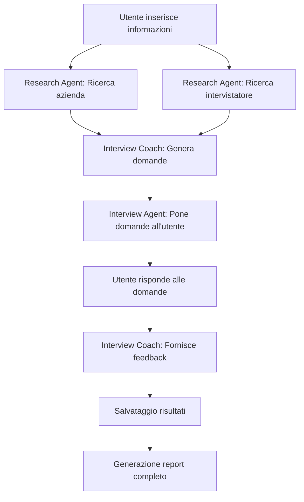

# AI Interview Preparation Assistant

Un'applicazione avanzata che utilizza l'intelligenza artificiale per aiutare gli utenti a prepararsi per i colloqui di lavoro, combinando l'interfaccia utente di Streamlit con il framework CrewAI per generare contenuti personalizzati e feedback interattivi.

> **Nota**: Questo progetto è nato seguendo il corso [Build AI Agents with CrewAI](https://zerotomastery.io/courses/learn-crewai-agents/) di Zero to Mastery, tenuto da Diogo Resende, a cui ho aggiunto un'interfaccia utente completa utilizzando Streamlit per rendere l'applicazione più accessibile e interattiva.

## Panoramica

L'AI Interview Preparation Assistant è uno strumento progettato per aiutare i candidati a prepararsi efficacemente per i colloqui di lavoro attraverso:

- Ricerca personalizzata sull'azienda e l'intervistatore
- Generazione di domande specifiche per la posizione lavorativa
- Simulazione di colloqui con feedback in tempo reale

L'applicazione utilizza modelli di linguaggio avanzati per creare un'esperienza di preparazione al colloquio su misura, considerando il settore specifico, la cultura aziendale e le tendenze del mercato locale.

## Funzionalità Principali

- **Ricerca Azienda**: Genera un report dettagliato sull'azienda target, compresi profilo, attività recenti e tendenze del settore
- **Ricerca Intervistatore**: Produce informazioni sul potenziale intervistatore, se disponibili
- **Generazione Domande**: Crea fino a 20 domande personalizzate in base al ruolo, all'azienda e al settore
- **Pratica Interattiva**: Permette di esercitarsi con le domande e ricevere feedback dettagliato
- **Report Scaricabili**: Tutti i contenuti generati sono disponibili in formato markdown scaricabile

## Architettura Tecnica

### Interfaccia Utente - Streamlit

L'applicazione utilizza Streamlit per creare un'interfaccia web interattiva con le seguenti pagine:

1. **Benvenuto**: Introduzione all'applicazione e guida all'utilizzo
2. **Ricerca**: Form per inserire informazioni sulla posizione desiderata
3. **Pratica**: Ambiente interattivo per esercitarsi con le domande generate
4. **Report**: Visualizzazione e download dei report generati

### Motore AI - CrewAI

Il cuore dell'applicazione è basato su CrewAI, un framework che consente di creare "crew" di agenti AI specializzati che collaborano per completare compiti complessi:

#### Agenti

1. **Research Agent**: Specializzato nella ricerca di informazioni sull'azienda e sull'intervistatore

   - Utilizza strumenti come SerperDevTool e ScrapeWebsiteTool per raccogliere dati aggiornati

2. **Interview Coach**: Esperto in preparazione ai colloqui per specifici settori

   - Genera domande personalizzate e fornisce feedback dettagliato

3. **Interview Agent**: Simula un intervistatore reale
   - Pone domande e valuta le risposte

#### Task Flow

Il flusso di lavoro dell'applicazione segue questi passaggi principali:

1. **Fase di Ricerca**:

   - L'utente inserisce informazioni sull'azienda, sulla posizione e sul settore
   - Il Research Agent conduce ricerche approfondite sull'azienda target
   - Il Research Agent raccoglie informazioni sull'intervistatore, se disponibili
   - L'Interview Coach genera domande personalizzate basate sui risultati della ricerca

2. **Fase di Pratica**:
   - L'utente si esercita rispondendo alle domande generate
   - L'Interview Coach fornisce feedback dettagliato sulle risposte
   - Le risposte e i feedback vengono salvati per riferimento futuro



## Implementazione Tecnica

### Struttura del Progetto

```
interview_prep/
├── src/
│   └── interview_prep/
│       ├── __init__.py
│       ├── crew.py               # Definizioni CrewAI
│       ├── config/
│       │   ├── agents.yaml       # Configurazione agenti
│       │   └── tasks.yaml        # Definizione task
│       └── utils/
│           └── interview_manager.py  # Gestione file e sessioni
├── app.py                        # Applicazione Streamlit
├── main.py                       # Interfaccia CLI alternativa
└── setup.py                      # Configurazione pacchetto
```

### Componenti Chiave

1. **InterviewPrepCrew (crew.py)**:

   - Implementa la classe `@CrewBase` che configura e orchestra gli agenti AI
   - Definisce metodi specializzati per diversi scenari (ricerca, feedback, ecc.)
   - Gestisce gli strumenti di ricerca e l'integrazione con API esterne

2. **InterviewManager (utils/interview_manager.py)**:

   - Gestisce il salvataggio e il caricamento dei file generati
   - Mantiene lo stato delle domande e delle sessioni
   - Fornisce funzioni di utilità per la sanitizzazione degli input

3. **Streamlit App (app.py)**:
   - Implementa l'interfaccia utente interattiva
   - Gestisce la sessione utente e il flusso dell'applicazione
   - Coordina l'interazione tra l'utente e il backend CrewAI

## Installazione e Configurazione

### Prerequisiti

- Python 3.10 o superiore
- Account API per OpenAI
- Account API per Serper (opzionale, per ricerche web avanzate)

### Installazione

1. Clona il repository:

```bash
git clone https://github.com/Pandagan-85/ai-agent-creaai
cd interview_prep
```

2. Installa le dipendenze:

```bash
pip install -e .
```

3. Crea un file `.env` nella directory principale con le tue chiavi API:

```
OPENAI_API_KEY=your_openai_api_key
SERPER_API_KEY=your_serper_api_key
```

### Avvio dell'Applicazione

**Interfaccia Web (Streamlit)**:

```bash
streamlit run app.py
```

**Interfaccia CLI**:

```bash
python main.py
```

## Personalizzazione

### Modifica degli Agenti

Per personalizzare gli agenti, modifica i file nella directory `config/`:

- `agents.yaml`: Modifica ruoli, obiettivi e backstory degli agenti
- `tasks.yaml`: Personalizza le istruzioni per i task specifici

### Estensione delle Funzionalità

Per aggiungere nuove funzionalità:

1. Aggiungi nuovi agenti in `crew.py` usando il decoratore `@agent`
2. Implementa nuovi task con il decoratore `@task`
3. Aggiorna l'interfaccia utente in `app.py` per interagire con i nuovi componenti

## Considerazioni sulla Privacy

- Tutti i dati utente vengono elaborati localmente
- L'applicazione può essere configurata per eliminare automaticamente i dati tra sessioni
- Le API esterne utilizzate sono soggette alle loro rispettive politiche sulla privacy

## Conclusione

L'AI Interview Preparation Assistant dimostra come combinare l'interfaccia utente intuitiva di Streamlit con la potenza dell'orchestrazione di agenti AI attraverso CrewAI. Questo approccio permette di creare applicazioni complesse che possono adattarsi a diversi contesti e fornire un'esperienza utente personalizzata.

Il flusso di lavoro modulare e l'architettura flessibile consentono facili estensioni e personalizzazioni, rendendo questo progetto un ottimo punto di partenza per sviluppare applicazioni AI avanzate per vari domini.
